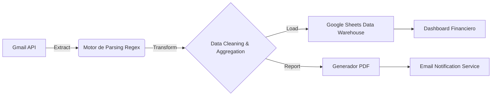

# 📊 Financial ETL Pipeline (Google Apps Script)


> Un pipeline **Serverless ETL (Extract, Transform, Load)** automatizado que procesa notificaciones bancarias transaccionales desde Gmail, estructura los datos en Google Sheets y distribuye reportes financieros ejecutivos en PDF.

---

## 🏗 Arquitectura del Sistema

El sistema sigue un patrón de arquitectura **Event-Driven** (basado en tiempo/triggers) utilizando el ecosistema de Google Workspace como infraestructura backend.

### Flujo de Datos
1.  **Ingesta (Extraction):** El script escanea la bandeja de entrada buscando correos de notificación bancaria específicos (filtrados por `Sender` y `Subject`) dentro de una ventana de tiempo definida (mes actual).
2.  **Procesamiento (Transformation):** Se utiliza **Regex** para parsear el cuerpo no estructurado de los correos HTML/Texto, extrayendo: *Fecha, Comercio (Merchant) y Monto*. Se normalizan los formatos de moneda y fecha.
3.  **Almacenamiento y Reporte (Load):**
    * Los datos limpios se vuelcan en **Google Sheets**, sobrescribiendo el snapshot mensual.
    * Se calcula un resumen de métricas (KPIs de gasto total).
    * Se renderiza la hoja de cálculo a **PDF** y se envía automáticamente vía correo electrónico.

*(Ver diagrama de flujo al final del documento)*

---

## 🚀 Características Técnicas

* **Zero-Infrastructure:** Ejecución 100% en la nube de Google (Serverless).
* **Idempotencia:** El script puede ejecutarse múltiples veces sin duplicar o corromper el reporte mensual (limpia y reconstruye el snapshot).
* **Parsers Personalizables:** Estructura modular que permite adaptar las expresiones regulares (Regex) para diferentes entidades bancarias.
* **Seguridad:** Manejo de datos sensibles mediante filtrado en el origen y procesamiento en memoria volátil.

---

## ⚙️ Configuración e Instalación

### Prerrequisitos
* Una cuenta de Google (Google Workspace o Gmail personal).
* Acceso a Google Drive y Google Sheets.

### Paso a Paso

1.  **Crear el Proyecto:**
    * Ve a [script.google.com](https://script.google.com/) y crea un nuevo proyecto.
    * Copia el contenido de `codigo.gs` en el editor.

2.  **Configuración de Variables (`CONFIG`):**
    Edita el objeto `CONFIG` al inicio del script con tus parámetros:
    ```javascript
    const CONFIG = {
      SEARCH_QUERY: 'from:"notificaciones@tubanco.com"', // Email de tu banco
      EMAIL_TO: "tu@email.com",
      SHEET_NAME: "Finanzas_Mes"
    };
    ```

3.  **Ajuste del Regex (Crucial):**
    Localiza la variable `regexCompra` dentro de `extractBankData()`. Deberás ajustar el patrón según el formato del correo que te envía tu banco.
    * *Ejemplo actual:* Soporta formato "Compraste $XX en COMERCIO...".

4.  **Permisos:**
    Al ejecutar por primera vez, Google solicitará permisos para acceder a:
    * Gmail (Leer correos).
    * Drive/Sheets (Crear y modificar archivos).
    * Enviar correos en tu nombre.

5.  **Automatización (Triggers):**
    Para que se ejecute automáticamente, configura un activador en el reloj del editor:
    * *Función:* `runFinancialETL`
    * *Fuente del evento:* Basado en tiempo (Time-driven).
    * *Frecuencia:* Mensual (ej. día 30) o Semanal.

---

## 📋 Ejemplo de Uso

El script generará una tabla en Google Sheets con el siguiente esquema:

| FECHA | COMERCIO / CONCEPTO | VALOR | CATEGORÍA |
| :--- | :--- | :--- | :--- |
| 2023-10-01 | AWS SERVICES | $ 50.00 | Infraestructura |
| 2023-10-05 | SUPERMERCADO | $ 120.00 | Hogar |

Y recibirás un correo electrónico con el asunto:
`[FINANCE-BOT] Reporte Mensual: OCTUBRE 2023` conteniendo el PDF adjunto.

---

## 🛡 Disclaimer de Seguridad

Este código procesa información financiera personal.
* **Privacidad:** El script se ejecuta dentro de tu propia cuenta de Google. Nadie más tiene acceso a los datos.
* **Recomendación:** No compartas el ID de tu Spreadsheet ni tus credenciales OAuth si haces fork de este proyecto.

---

## 🤝 Contribución

Las Pull Requests son bienvenidas. Para cambios mayores, por favor abre un issue primero para discutir lo que te gustaría cambiar.

1.  Fork el proyecto
2.  Crea tu Feature Branch (`git checkout -b feature/AmazingFeature`)
3.  Commit tus cambios (`git commit -m 'Add some AmazingFeature'`)
4.  Push al Branch (`git push origin feature/AmazingFeature`)
5.  Abre un Pull Request

---

Desarrollado con ☕ y 💻 por **Javi Giraldo**.

---

## 📐 Anexo: Diagrama de Arquitectura


